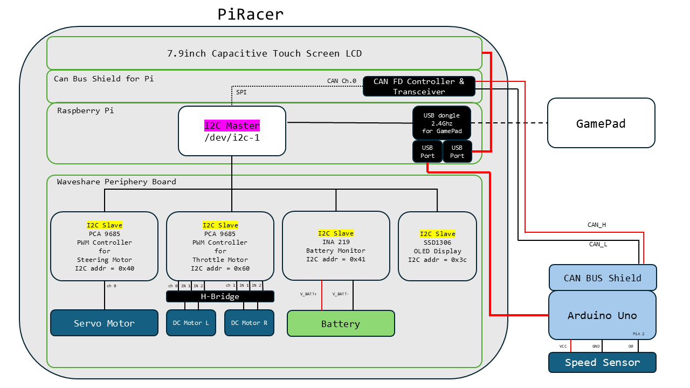

# 🏎️ PiRacer Smart Dashboard & Control System

This project is a **wireless control and real-time digital dashboard system** for the PiRacer (Raspberry Pi-based RC car). It supports wireless gamepad input for driving and gear control, and receives vehicle velocity via **CAN bus** for display in a graphical dashboard using `pygame`.

---

## 🚀 Features

### 🎮 Wireless Gamepad Control
- Supports **ShanWan Gamepad** (via USB wireless dongle)
- **Gear Selection**:
  - B → Drive (D)
  - A → Neutral (N)
  - X → Reverse (R)
  - Y → Park (P)
- **Speed Gear Shifting**:
  - R2 → Upshift (1 to 4)
  - L2 → Downshift (4 to 1)
- **Analog Control**:
  - Right joystick (Y-axis) → throttle
  - Left joystick (X-axis) → steering
- Throttle input is automatically scaled by current speed gear (25% per level)

### 📡 CAN Bus Velocity Monitoring
- Reads real-time speed data over CAN bus (`can1`, 500kbps)
- CAN messages with ID `0x100` are interpreted as velocity (first 2 bytes)
- Velocity is stored in a shared memory variable for cross-process access

### 📊 Graphical Dashboard
- Built with `pygame`, supports:
  - Speed (km/h)
  - Gear level (1 to 4)
  - Drive mode (D / N / R / P)
- Refreshes at ~20Hz

---

## 🧠 System Architecture



## 🔧 Component Overview
### 🎮 GamePad + USB Dongle
- Wireless controller paired via 2.4GHz USB dongle.

- Plugs into a USB port on the Raspberry Pi.

- Provides user input for:

    - Throttle

    - Steering

    - Gear selection (P/N/R/D)

### 💻 Raspberry Pi 4B
- Central processing unit of the system.

- Handles:

    - CAN Communication via SPI with a CAN FD Controller.

    - UI Rendering via a 7.9" DSI Capacitive Touch Screen.

    - Motor Control via I2C to the periphery board.

    - Gamepad Input via USB dongle.

- Runs two multiprocessing components:

    - Drive Control: Reads gamepad input and commands motors.

    - CAN Receiver: Listens for velocity data and shares it through IPC (multiprocessing.Value).

### 🔁 CAN Bus Subsystem
- Consists of an Arduino Uno with a CAN BUS Shield.

- A  Speed Sensor (rotary encoder) measures wheel RPM.

- Sends RPM data as a CAN frame with ID 0x100 to Raspberry Pi.

- Baudrate: 500 kbps

### 🔌 Waveshare Periphery Board (I2C)
- Connected to Raspberry Pi via /dev/i2c-1.

- Handles:

    - PWM output to steering and throttle motors.

    - Battery voltage & current monitoring (INA219 at 0x41).

    - OLED display output (SSD1306 at 0x3C).
```
Address	|| Component  || Description
----------------------------------------------
0x40	|| PCA9685    || Steering motor PWM
0x60	|| PCA9685    || Throttle motor PWM
0x41	|| INA219     || Battery monitoring
0x3C	|| SSD1306    || OLED display (optional)
```
### 📺 UI Dashboard (via Pygame)
- Continuously shows:

    - 🔁 Current velocity (converted from RPM to km/h)

    - ⚙️ Gear state (P, N, R, D)

    - 🔄 Drive mode (NORMAL, REVERSE, etc.)

- Runs at 20 FPS (updated every 50ms).

- Displayed on the 7.9" touch screen connected via DSI.
